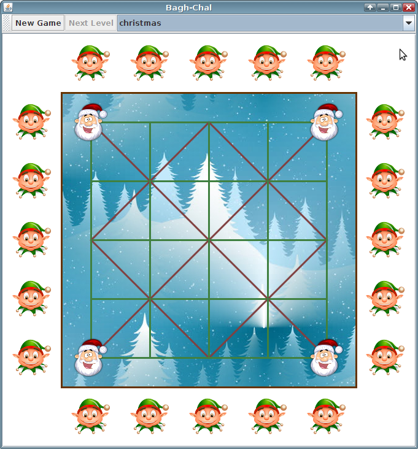
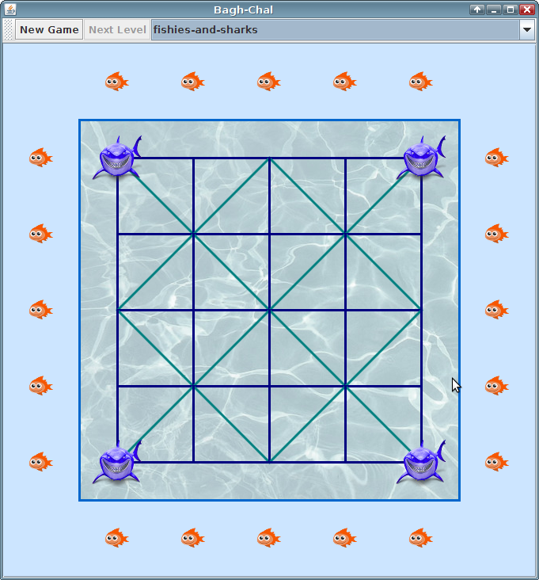

# bagh-chal

Install and run
---------------

1) [Download and install Java](https://java.com/en/download/)

During the Java installation, make sure to unselect any 3rd party add-ons, like Yahoo browser plugin, etc.

2)  

This will download the file "bagh-chal.jar". When the download is finished double-click it to run the game.

Screenshots
-----------
Goats and Tigers

Elfs and Santas

Sharks and Fishies

Build status
------------

Credits and code structure
--------------------------

- Originally based on code by Daniel Newman (danielnewman106@hotmail.com)
- All code was completely rewritten and reorganized
- Design Patterns : Model-View-Controller, Object-orientation
- Codebase now uses Dependency Inject Yourself (DIY) for decoupling
- What used to be an Applet is now a downloadable Swing application (jar)

Functional Improvements
-----------------------
- Added sound effects 
- Fixed flicker when dragging goats
- Theming support
- Flexible game board dimensions
- Added preliminary goat AI (work in progress)
