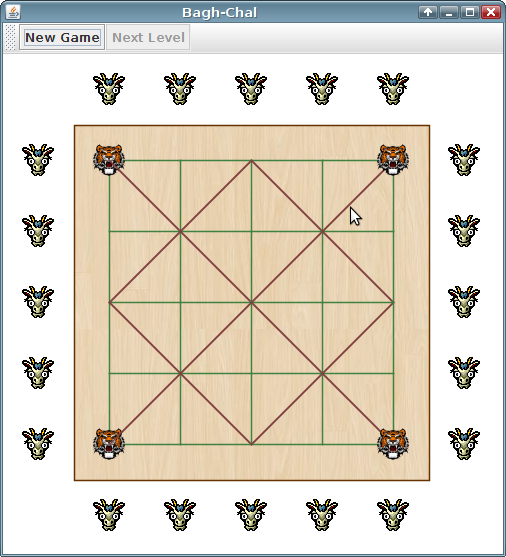
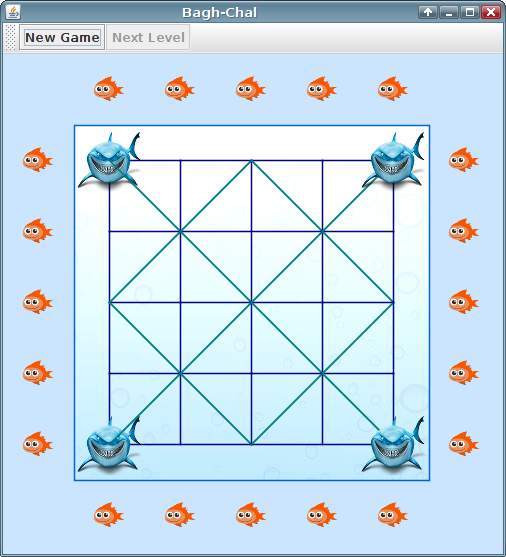

# bagh-chal

Install and run
---------------

1) [Download and install Java](https://java.com/en/download/)

During the Java installation, make sure to unselect any 3rd party add-ons, like Yahoo browser plugin, etc.

2) [Download and run Bagh-chal](https://bintray.com/artifact/download/odoepner/generic/bagh-chal.jar)

This will download the file "bagh-chal.jar". When the download is finished double-click it to run the game.

Screenshots
-----------
Goats and Tigers

Sharks and Fishies

Origin and improvements
-----------------------

- Based on http://goatsandtigers.com/downloads/goats_and_tigers_1_java.zip
- Copyright of the original code by Daniel Newman (danielnewman106@hotmail.com)
- Converted Applet to JFrame
- Added sounds 
- Refactored into classes
- Fixed flicker when dragging goats
- Level theming support
- Flexible game board dimensions
